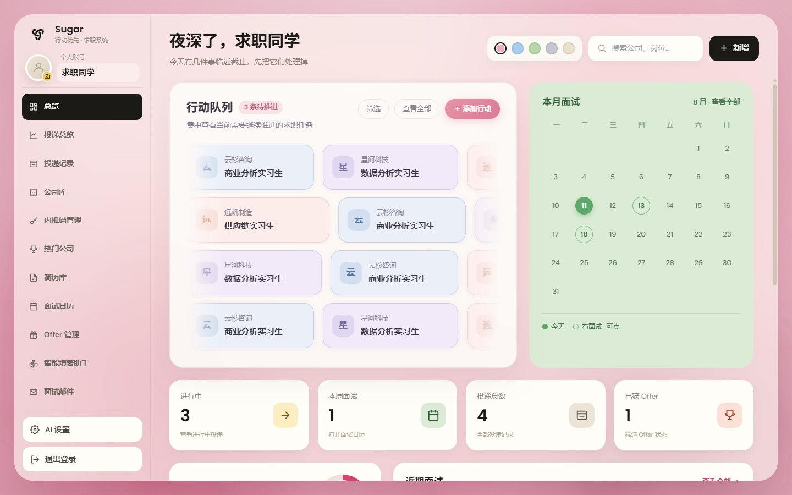
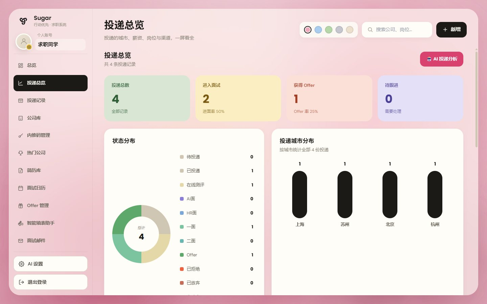
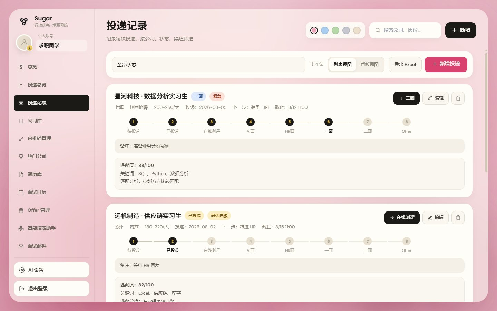
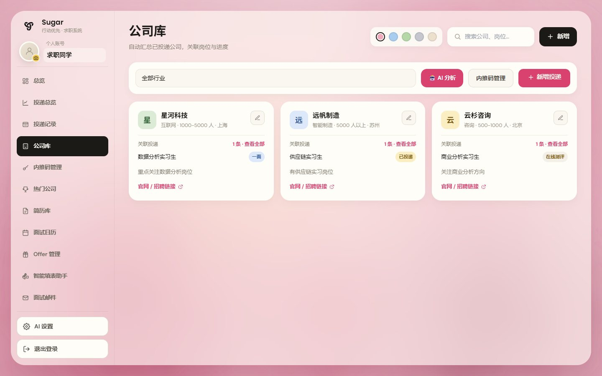
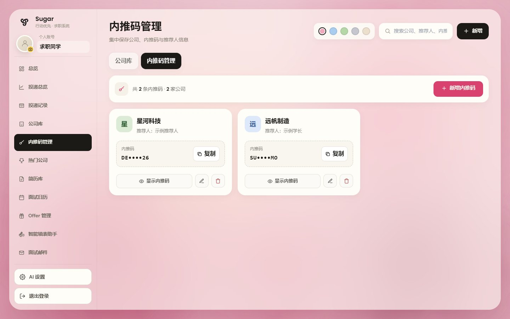
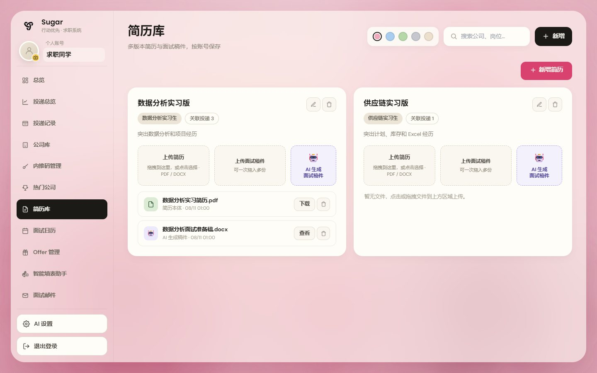
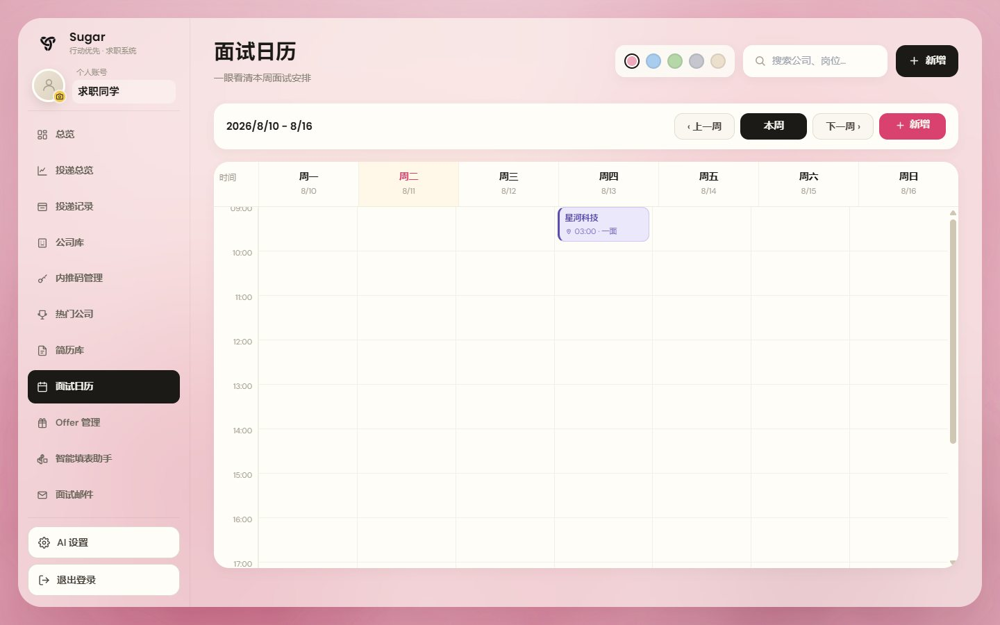
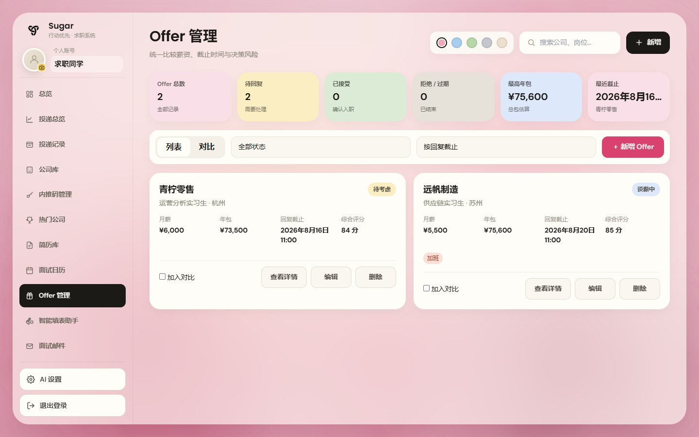
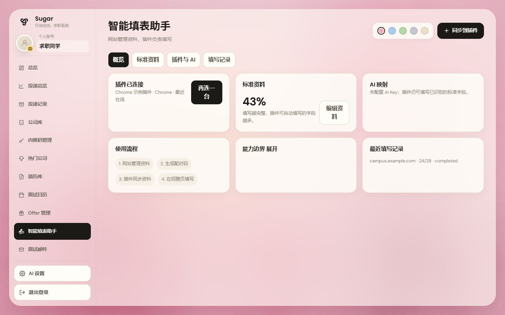
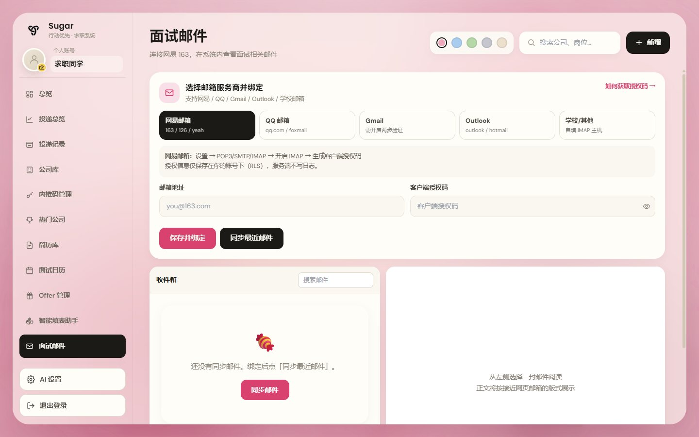

# Sugar 求职系统 🍬

一个用来整理求职信息的网页。

投过哪些岗位、关注过哪些公司、用的是哪份简历、什么时候面试、拿到了哪些 Offer，都可以放在这里统一查看，不用再把信息分散记在 Excel、备忘录和聊天软件里。

## 在线访问

项目已经上线，可以通过下面的网址打开：

**[https://sugarv.mom](https://sugarv.mom)**

备用访问地址：[https://sugar-job-system.vercel.app/](https://sugar-job-system.vercel.app/)

> 目前需要先开启网络代理（梯子）再访问。如果页面打不开，请先确认代理是否已经打开。

<p align="center">
  
</p>

> README 中的公司、岗位、简历、内推码和面试安排均为虚构演示数据，不包含真实个人信息。

## 这个网页能做什么

Sugar 把求职过程中经常要处理的事情放到了一起：记录投递、整理公司、保存不同版本的简历、安排面试、比较 Offer，还可以连接浏览器插件，减少招聘网站上的重复填表工作。

一次完整的使用过程大致是：

```text
添加投递 → 记录公司和简历 → 跟进招聘进度 → 安排面试 → 比较 Offer
                                      ↓
                         用填表助手减少重复填写
```

## 功能介绍

### 一、求职主线

#### 1. 总览

总览页把近期最需要处理的事情放在前面，包括待跟进的投递、即将开始的面试、投递总数和已经拿到的 Offer。

右侧日历可以查看本月的面试日期，下面还能继续查看投递进度和近期安排。平时打开网页后，先看这一页就能知道接下来该做什么。

<p align="center">
  
</p>

#### 2. 投递总览

投递总览会把现有投递整理成图表，可以看到投递数量、进入面试的数量、Offer 数量，以及状态、城市、岗位和投递渠道的分布。

如果想进一步分析自己的投递情况，也可以直接在这个页面向 AI 提问，例如哪些岗位进展更好、哪些城市投得更多。

<p align="center">
  
</p>

#### 3. 投递记录

每次投递都可以单独保存公司、岗位、城市、渠道、投递日期、薪资范围和岗位链接。

还可以继续记录岗位要求、关键词、匹配情况、下一步行动、截止时间和优先级。页面支持按状态筛选、列表与看板切换、直接推进招聘进度，以及导出 Excel。

<p align="center">
  
</p>

### 二、公司与简历

#### 4. 公司库

公司库用来集中整理已经投递或正在关注的公司。每家公司可以保存行业、城市、规模、官网和备注，并自动显示与这家公司有关的投递岗位和当前进度。

需要比较几家公司时，可以在这里快速找到对应记录，也可以让 AI 根据现有信息帮助分析。

<p align="center">
  
</p>

#### 5. 内推码管理

内推码管理用来保存公司内推码、推荐人、岗位、来源和有效期。

内推码默认会隐藏一部分字符，需要时可以显示或一键复制。已经使用或快过期的内推码也可以单独标记，避免临时找不到或忘记使用。

<p align="center">
  
</p>

#### 6. 热门公司

热门公司页面按行业整理了一批常见招聘企业，可以搜索公司、查看招聘官网和校招状态。

自己关注的公司可以添加到“我添加的公司”中。如果还没有明确目标，也可以输入专业、城市或求职方向，让 AI 整理一批候选公司，再由自己决定是否保存。

<p align="center">
  
</p>

#### 7. 简历库

简历库可以按照不同岗位保存多份简历，例如数据分析版、供应链版或产品岗位版。

每个版本都能关联已有投递，并上传 PDF 或 DOCX 文件。上传简历后，还可以根据简历内容生成面试准备稿，并下载为文档继续修改。

<p align="center">
  
</p>

简历卡片还提供“求职辅助”入口，可围绕当前简历完成一条连续流程：选择校招或社招、分析并确认简历画像、保存求职偏好、粘贴 JD 检查硬门槛和匹配度、生成不虚构事实的定制文字草稿、写入现有投递记录，以及进行一次一题的文字模拟面试。定制草稿可以另存为新的简历版本，不会覆盖原简历或已有面试稿件。

求职辅助不会自动点击招聘网站的最终提交，不处理密码、Cookie、验证码、身份证、银行卡、健康/犯罪/征信、电子签名或法律声明，也不会生成或换脸证件照。模拟面试只保存分数和简短改进摘要，不保存回答原文或完整润色答案。第一期的网申草稿入口仅作预留，不包含浏览器自动填表。

### 三、面试与决策

#### 8. 面试日历

面试日历按周展示面试安排，可以记录公司、岗位、面试时间、面试轮次、电话或视频等面试形式，以及需要提前准备的事项。

点击日历中的面试可以查看或修改内容，也可以切换上一周和下一周，避免面试时间冲突。

<p align="center">
  
</p>

#### 9. Offer 管理

Offer 管理可以记录公司、岗位、城市、月薪、奖金、补贴、年包、入职日期和回复截止时间。

除了保存基本信息，还可以记录岗位匹配、成长空间、工作强度、谈薪情况和需要注意的风险。拿到多个 Offer 时，可以勾选后放在一起比较。

<p align="center">
  
</p>

#### 10. 智能填表助手

智能填表助手由网站和 Chrome 插件配合使用。网站负责整理标准资料，插件负责在招聘网站中识别输入框并填写内容。

标准资料可以保存教育经历、实习经历、工作经历、项目经历、求职偏好和技能。也可以上传 PDF、DOCX 或 TXT 简历，让 AI 帮忙提取已有内容，再由自己检查和补充。

这个页面还可以管理已连接的插件、选择同步范围、设置 AI 服务，以及查看最近填写了多少字段。插件不会自动提交申请，不会代替用户上传附件，也不会处理验证码。

<p align="center">
  
</p>

#### 11. 面试邮件

面试邮件页面可以连接网易、QQ、Gmail、Outlook 或学校邮箱，在系统里查看和搜索面试相关邮件。

选择一封邮件后，可以在右侧阅读正文，方便把面试通知和其他求职记录放在一起查看。邮箱连接使用客户端授权码，不使用邮箱登录密码。

<p align="center">
  
</p>

### 四、其他使用体验

- **AI 设置**：可以选择自己使用的 AI 服务和模型，用于公司查找、投递分析、简历整理和面试稿生成。
- **主题切换**：页面顶部可以切换粉、蓝、绿、灰和米白主题。
- **全局搜索**：可以按照公司或岗位快速查找已有记录。
- **电脑与手机适配**：电脑端使用侧边栏，手机端会改成更适合单手操作的底部导航和卡片布局。
- **操作提醒**：新增、修改、删除和加载失败时会给出明确提示，避免不知道操作有没有成功。

## 建议的使用顺序

1. 先在“投递记录”中添加正在申请的岗位。
2. 到“公司库”和“热门公司”整理自己关注的企业。
3. 在“简历库”保存不同岗位使用的简历版本。
4. 收到面试通知后，把时间添加到“面试日历”。
5. 拿到 Offer 后，在“Offer 管理”中记录并比较。
6. 如果经常重复填写招聘网站，可以整理“标准资料”并连接填表插件。

## 代码结构

项目主要使用 React、TypeScript、Vite 和 Tailwind CSS。代码按照页面、共用组件和业务功能分开存放。

```text
sugar-job-system/
├─ src/
│  ├─ pages/                         各个功能页面
│  ├─ components/                    导航、按钮、弹窗、表单等共用界面
│  │  └─ resume-assistant/           智能填表助手的页面组件
│  ├─ layouts/                       电脑端和手机端的整体页面框架
│  ├─ contexts/                      登录、主题、AI 设置和页面状态
│  ├─ hooks/                         读取、保存和更新数据的公共逻辑
│  ├─ lib/                           文件导出、简历处理和其他工具
│  ├─ styles/                        页面主题和全局样式
│  ├─ types/                         TypeScript 数据类型
│  ├─ App.tsx                        页面入口和功能切换
│  └─ main.tsx                       前端启动入口
├─ api/                              网页调用的接口代码
├─ browser-extension/                Chrome 智能填表插件
├─ public/                           Logo 和其他静态文件
├─ docs/images/readme/               README 使用的页面截图
├─ package.json                      项目依赖和常用命令
├─ vite.config.ts                    Vite 配置
├─ tailwind.config.js                Tailwind CSS 配置
└─ tsconfig.json                     TypeScript 配置
```

### 主要目录怎么配合

- `pages` 负责拼出完整页面。
- `components` 保存多个页面都会使用的界面，避免重复编写。
- `hooks` 处理读取、添加、修改和删除等公共逻辑。
- `contexts` 保存登录状态、当前主题和页面之间共用的状态。
- `lib` 放文件导出、简历处理和格式转换等工具。
- `api` 接收网页请求，并负责 AI、邮箱和浏览器插件等功能的接口处理。
- `browser-extension` 是与网站配套使用的 Chrome 插件代码。

## 本地运行

需要先安装 Node.js，然后在项目目录中运行：

```bash
npm install
npm run dev
```

启动后打开：

```text
http://localhost:5173
```

检查项目能否正常打包：

```bash
npm run build
```

完整的登录、在线同步、AI 和邮箱功能还需要准备项目使用的本地环境变量。

首次使用“求职辅助”前，还需要在目标 Supabase 项目应用迁移：

```text
supabase/migrations/20260812052749_job_assist_mvp.sql
supabase/migrations/20260812065000_job_assist_foreign_key_indexes.sql
```

迁移只增加求职辅助表和 `jd_matches` 扩展字段，并为新表启用按账号隔离的 RLS；不会删除现有简历、投递或面试稿件。完整手动验收步骤见 [docs/job-assist-manual-check.md](docs/job-assist-manual-check.md)。

---


